# netcafe-guard

> 面向租赁制、多租户、带 AI 终端的安全基线——从这个未来已经存在的地方做起:网吧。

[English](README.md) | **中文**

[](https://github.com/magnoormeno-dot/netcafe-guard/actions/workflows/ci.yml)
[](https://www.npmjs.com/package/netcafe-guard)
[](LICENSE)
[](package.json)

<p align="center">
  
</p>
<p align="center"><sub>一台"经典体检全绿"的机器,在真正要命的地方仍是 F。从仓库克隆后可复现:<br>
<code>node bin/netcafe-guard.js scan --facts demo/cafe-pc-07.json --platform win32</code></sub></p>

## 为什么做这个

硬件价格被 AI 越推越高,计算正在从"拥有"走向"租用"。而**网吧就是现存最成熟的租赁计算形态**:成千上万的场馆,每隔几小时把同一台机器交给一个陌生人。今天它服务的是玩家;当租赁计算开始承载**工作**,它就必须承载 **AI**——因为 AI 助手和智能体正在成为工作的入口,而不是附件。

于是对任何运营共享机位的场馆和企业,有一个问题变得决定性:**一小时前陌生人用过的那台机器上,AI 到底暴露了什么?**

与此同时,真正在大规模运营租赁计算的人——网吧和电竞馆的老板与网管——手里几乎没有任何安全工具:没有基线、没有漂移检测、没办法回答"这台机器对下一位顾客安全吗"。

`netcafe-guard` 现在就补上这个缺口,为将要到来的一切做好准备。完整论证见 **[docs/VISION.md](docs/VISION.md)**。

### 两种"AI 入侵",别混为一谈

- **AI 是攻击者的工具**——便宜、自适应、自动化的攻击。这是"必须有基线"的理由。
- **你请进来的 AI 本身就是暴露面**——助手和智能体名正言顺地要读你的文件、看你的屏幕、持有 API 凭据、执行工具。在租赁机器上,这里的每一项都是跨租户泄露。这一种是新的、几乎没人度量的、而且**今天就能检测**。

本扫描器度量的是第二种。

## 它做什么

对照加固基线读取机器配置,用大白话报告:下一位顾客——或者一个随手路过的攻击者——能利用什么。

**设计上完全只读。** 它绝不修改被审计的机器。会去改动租赁机器的扫描器,本身就会成为多租户风险。

```
  netcafe-guard  security baseline scan
  host: CAFE-PC-07  ·  platform: win32/x64

  Score: 0/100  (F)
  FAIL [critical] tenant-session-restore-active     还原/写保护正在生效
        fix: 没有它,租赁机器上的一切防护都可能被上一位使用者破坏……
  FAIL [critical] ai-recall-disabled                屏幕回忆/AI 数据分析截屏已关闭
        fix: 下一位顾客可以一帧一帧翻看上一位的网银页面……
  FAIL [critical] tenant-no-leftover-credentials    无残留凭据或 AI 智能体密钥文件
        observed: ["~/.ssh/id_rsa","~/.aws/credentials"]
  FAIL [high]     ai-clipboard-history-disabled     剪贴板历史已关闭
  ...
```

## 安装

需要 Node.js 18+。

```bash
npx netcafe-guard scan          # 免安装,一次性运行
npm install -g netcafe-guard    # 或全局安装
```

## 用法

```bash
netcafe-guard scan                    # 体检本机,列出问题
netcafe-guard scan --all              # 显示每一项检查,包括通过项
netcafe-guard scan --json > out.json  # 机器可读,接仪表盘
netcafe-guard scan --fail-under 80    # 低于分数线退出码非零——给计划任务/CI 用
netcafe-guard scan --rules ./cafe.json  # 用你自己的规则集
netcafe-guard list-rules              # 基线都查什么?
```

装机镜像做完跑一次、改过配置跑一次、再用计划任务定时跑
(任务计划程序 → `netcafe-guard scan --fail-under 80`),配置漂移就藏不住。

### 打分

从 100 分起步,按严重程度扣分(critical −25、high −15、medium −8、low −3)。
它是**分诊工具,不是合规证书**。扫描器读不到的项一律报 **unknown**——
绝不默认安全。

## 基线

规则按 VISION 文档论证的优先级分组:

| 优先级 | 类别 | 检查项 |
| --- | --- | --- |
| 1 | **多租户卫生** | 还原/写保护是否生效 · 残留凭据与 AI 智能体密钥文件 · 浏览器密码保存 |
| 2 | **AI 暴露面** | 屏幕回忆截屏 · 剪贴板历史 · 跨设备剪贴板同步 · 助手策略是否明确 |
| 3 | **经典基线** | 自动登录 · 注册表明文密码 · 来宾账户 · 入站 RDP · 自动播放 · 防火墙 · Defender 实时防护 · 屏幕自动锁定 |

优先级 3 不性感,但在一线仍在大面积失守,所以它保留并长期维护。优先级 1 排最前,因为没有它,上一位使用者可以把清单上其他所有防护统统撤掉。

完整规则与字段说明:[`docs/RULES.md`](docs/RULES.md)。

## 边界纪律

"面向未来"不是"发布空想"的许可证:

- **每条规则必须今天就能在真机上检测。** 只能被描述、不能被读取的威胁,进 [docs/VISION.md](docs/VISION.md) 当论点——不进 `rules/` 当检查。
- **永远只读。**

## 自带规则

规则是纯 JSON,不用写代码:

```json
{
  "id": "ai-recall-disabled",
  "title": "Screen recall / AI data analysis capture is disabled",
  "severity": "critical",
  "category": "ai-surface",
  "platforms": ["win32"],
  "check": { "fact": "recallDisabled", "operator": "isTrue" },
  "remediation": "Set DisableAIDataAnalysis to 1 under ...WindowsAI"
}
```

## 路线图

- [ ] 更多 AI 面规则:本地智能体工具配置、共享主机上的 MCP 服务暴露
- [ ] 网吧管理套件检测(各地区的还原/写保护软件)
- [ ] Linux 与 macOS 基线(图书馆共享终端、Mac kiosk)
- [ ] `--profile gaming-cafe` 与 `--profile shared-office` 规则集
- [ ] HTML 报告输出,直接交给不懂技术的老板
- [ ] 修复建议本地化(中文优先)

## 参与贡献

最想要的贡献:**真正运营这些场馆的人带来的真实规则**,以及你所在地区网吧管理套件/还原软件的检测(告诉我们服务名就行)。大多数规则贡献不需要写任何 JavaScript。从 [CONTRIBUTING.md](CONTRIBUTING.md) 和 [good first issues](https://github.com/magnoormeno-dot/netcafe-guard/labels/good%20first%20issue) 开始。

## 许可证

[MIT](LICENSE) © 2026 shine leek
